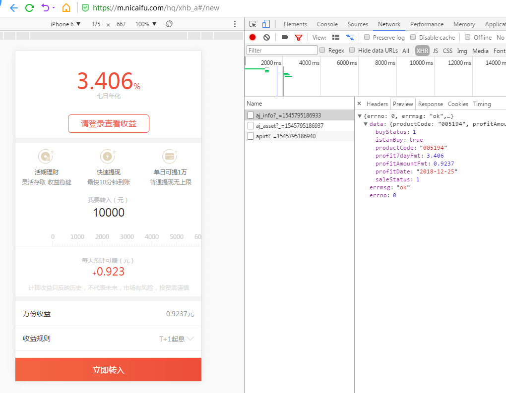
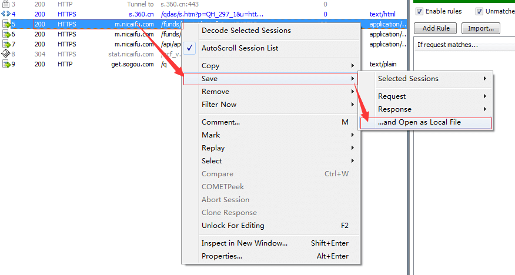
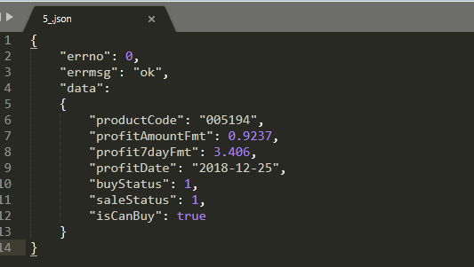
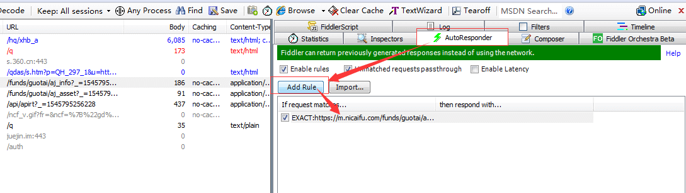
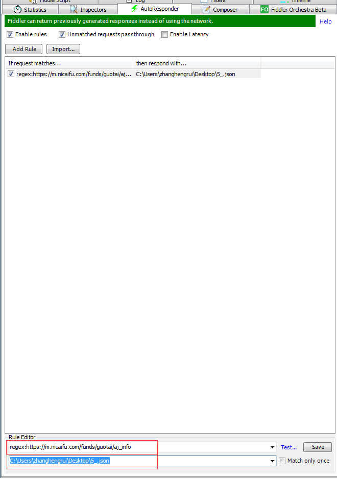
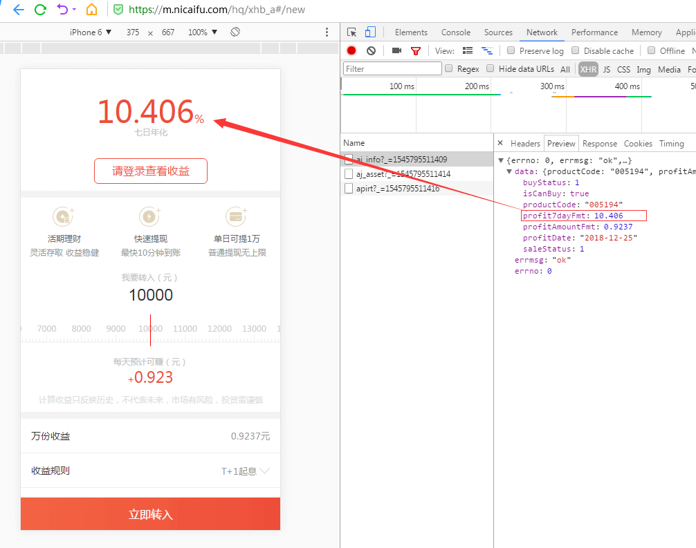

### 1. 接口抓包
找到要mock的接口
```
以https://m.nicaifu.com/hq/xhb_a#/new为例，找到下面的接口
https://m.nicaifu.com/funds/guotai/aj_info
```



### 2. 复制接口数据到本地
在接口上进行右键点击，选择save -> …and Open as Local File -> 默认会保存至桌面



### 3. 修改数据
修改保存到本地的json文件，示例中仅修改了页面的标签数据。


### 4. 增加监听规则
选择工具栏 AutoResponder -> Add Rule


### 5. 修改规则
如下图，推荐使用正则方式匹配url

```
格式：regex:url  
regex代表通过正则匹配，url代表需要监听的接口地址
```


### 6. 匹配数据
Local file to return ... 选择下拉列表中的Find a file ... 找到保存到本地的数据

### 7. save，刷新页面
