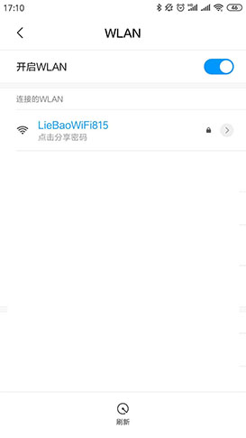
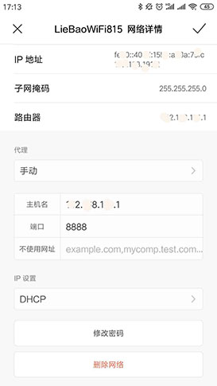
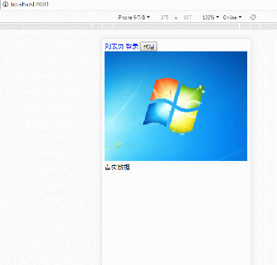
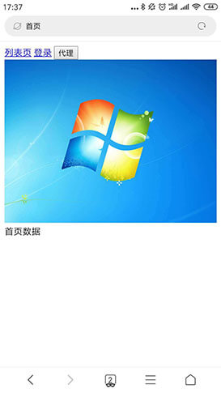

## 利用fiddler，在手机上调试本地效果
#### 电脑需安装共享热点，本示例使用的猎豹免费wifi，如图

#### 获取本地电脑IP地址
```
运行 -> cmd -> ipconfig
```

#### 手机连接热点，如图

#### 设置热点参数，如图

#### 打开fiddler，Tools->Options->connections,确认fiddler端口号，默认8888

#### 本地执行node服务（若拥有项目本地开发地址，则跳过）

#### 使用手机，打开浏览器访问127.0.0.1:8081
